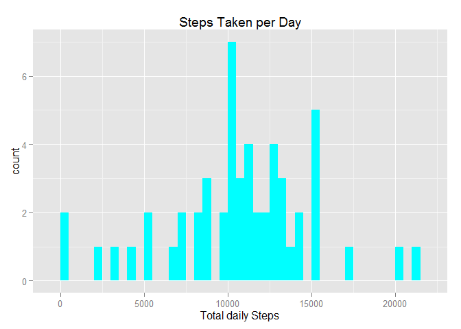
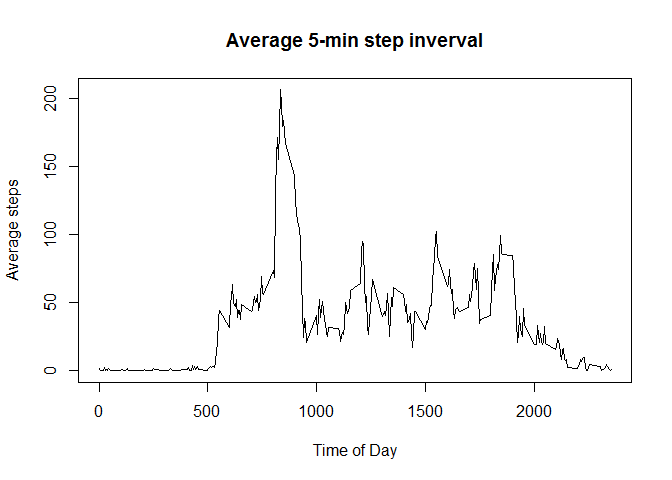
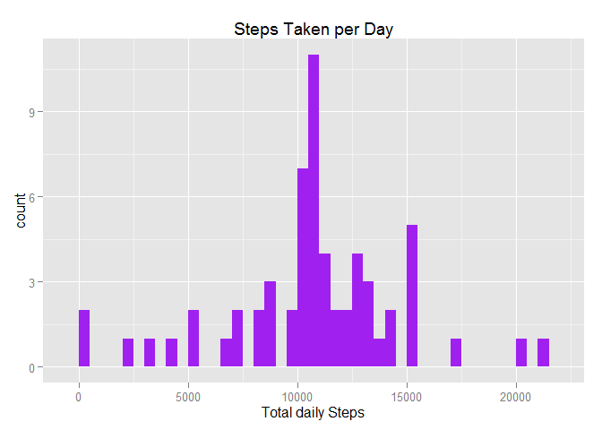
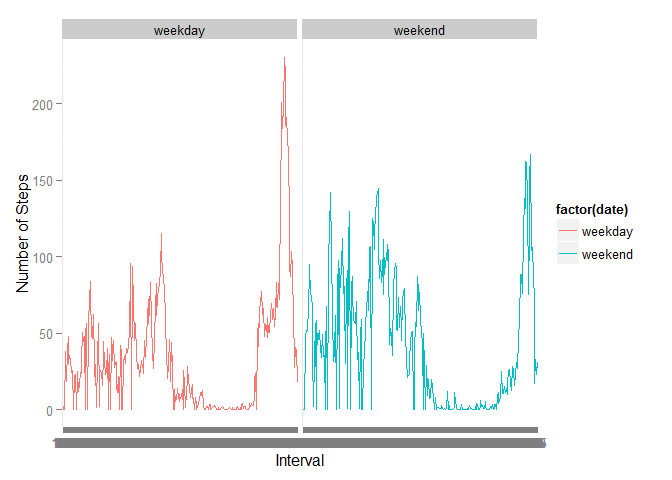

# Reproducible Research: Peer Assessment 1

## Introduction

It is now possible to collect a large amount of data about personal
movement using activity monitoring devices such as a
[Fitbit](http://www.fitbit.com), [Nike
Fuelband](http://www.nike.com/us/en_us/c/nikeplus-fuelband), or
[Jawbone Up](https://jawbone.com/up). These type of devices are part of
the "quantified self" movement -- a group of enthusiasts who take
measurements about themselves regularly to improve their health, to
find patterns in their behavior, or because they are tech geeks. But
these data remain under-utilized both because the raw data are hard to
obtain and there is a lack of statistical methods and software for
processing and interpreting the data.

This assignment makes use of data from a personal activity monitoring
device. This device collects data at 5 minute intervals through out the
day. The data consists of two months of data from an anonymous
individual collected during the months of October and November, 2012
and include the number of steps taken in 5 minute intervals each day.

## Data

The data for this assignment can be downloaded from the course web
site:

* Dataset: [Activity monitoring data](https://d396qusza40orc.cloudfront.net/repdata%2Fdata%2Factivity.zip) [52K]

The variables included in this dataset are:

* **steps**: Number of steps taking in a 5-minute interval (missing
    values are coded as `NA`)

* **date**: The date on which the measurement was taken in YYYY-MM-DD
    format

* **interval**: Identifier for the 5-minute interval in which
    measurement was taken


The dataset is stored in a comma-separated-value (CSV) file and there
are a total of 17,568 observations in this
dataset.


## Assignment

This assignment will be described in multiple parts. You will need to
write a report that answers the questions detailed below. Ultimately,
you will need to complete the entire assignment in a **single R
markdown** document that can be processed by **knitr** and be
transformed into an HTML file.

Throughout your report make sure you always include the code that you
used to generate the output you present. When writing code chunks in
the R markdown document, always use `echo = TRUE` so that someone else
will be able to read the code. **This assignment will be evaluated via
peer assessment so it is essential that your peer evaluators be able
to review the code for your analysis**.

For the plotting aspects of this assignment, feel free to use any
plotting system in R (i.e., base, lattice, ggplot2)

Fork/clone the [GitHub repository created for this
assignment](http://github.com/rdpeng/RepData_PeerAssessment1). You
will submit this assignment by pushing your completed files into your
forked repository on GitHub. The assignment submission will consist of
the URL to your GitHub repository and the SHA-1 commit ID for your
repository state.

NOTE: The GitHub repository also contains the dataset for the
assignment so you do not have to download the data separately.


```r
library(knitr)
library(ggplot2)                  #for my charts
```

```
## Warning: package 'ggplot2' was built under R version 3.1.3
```

```r
opts_chunk$set(echo = TRUE)       #so you can see it
options(scipen = 1, digits = 3)   #fix funky scientific notation
```

### Loading and preprocessing the data

Show any code that is needed to

1. Load the data (i.e. `read.csv()`)

2. Process/transform the data (if necessary) into a format suitable for your analysis


```r
# set dir and read in data
setwd("D:/mydata/represearch/RepData_PeerAssessment1")
actdata <- read.csv(unz("activity.zip", "activity.csv"), header = TRUE)
# preprocess by setting col classes
actdata$steps <- as.numeric(actdata$steps)
actdata$date <- as.Date(actdata$date, format = "%Y-%m-%d")
actdata$interval <- as.factor(actdata$interval)
str(actdata) #looking at the new DF
```

```
## 'data.frame':	17568 obs. of  3 variables:
##  $ steps   : num  NA NA NA NA NA NA NA NA NA NA ...
##  $ date    : Date, format: "2012-10-01" "2012-10-01" ...
##  $ interval: Factor w/ 288 levels "0","5","10","15",..: 1 2 3 4 5 6 7 8 9 10 ...
```

### What is mean total number of steps taken per day?

For this part of the assignment, you can ignore the missing values in
the dataset.

1. Make a histogram of the total number of steps taken each day

2. Calculate and report the **mean** and **median** total number of steps taken per day

**First, we shall calculate total steps per day**

```r
stepsPerDay <- aggregate(steps ~ date, actdata, sum)
colnames(stepsPerDay) <- c("date", "steps")
head(stepsPerDay) #looking at the new DF
```

```
##         date steps
## 1 2012-10-02   126
## 2 2012-10-03 11352
## 3 2012-10-04 12116
## 4 2012-10-05 13294
## 5 2012-10-06 15420
## 6 2012-10-07 11015
```
**Now, lets make that histogram for item 1 above**

```r
ggplot(stepsPerDay, aes(x = steps)) +
    geom_histogram(fill = 'cyan', binwidth = 500) +
    labs(title="Steps Taken per Day", x = "Total daily Steps")
```

 

**Then, calculate the mean and median to answer item 2**

```r
stepsMean <- mean(stepsPerDay$steps, na.rm=TRUE)
stepsMedian <- median(stepsPerDay$steps, na.rm=TRUE)
```
The **mean** total number of steps taken per day is **10766.189**. 
The **median** total number of steps taken per day is **10765**.

### What is the average daily activity pattern?

1. Make a time series plot (i.e. `type = "l"`) of the 5-minute interval (x-axis) and the average number of steps taken, averaged across all days (y-axis)


```r
actdata$interval <- as.factor(as.character(actdata$interval))
intervalMean <- as.numeric(tapply(actdata$steps, actdata$interval, mean, na.rm=TRUE))
intervals <- data.frame(intervals = as.numeric(levels(actdata$interval)), intervalMean)
intervals <- intervals[order(intervals$intervals), ]


plot(intervals$intervals, intervals$intervalMean, type = "l", 
     main = "Average 5-min step inverval", 
     ylab = "Average steps", xlab = "Time of Day" )
```

 


2. Which 5-minute interval, on average across all the days in the dataset, contains the maximum number of steps?


```r
MaxMeanSteps <- intervals[which.max(intervals$intervalMean), ]
head(MaxMeanSteps) #looking at the new DF
```

```
##     intervals intervalMean
## 272       835          206
```
**The 5-min interval is 835 which has 206 steps.**


### Imputing missing values

Note that there are a number of days/intervals where there are missing
values (coded as `NA`). The presence of missing days may introduce
bias into some calculations or summaries of the data.

1. Calculate and report the total number of missing values in the dataset (i.e. the total number of rows with `NA`s)


```r
naVals <- sum(is.na(actdata$steps))
```
**Total number of rows with missing values is 2304**

2. Devise a strategy for filling in all of the missing values in the dataset. The strategy does not need to be sophisticated. For example, you could use the mean/median for that day, or the mean for that 5-minute interval, etc.


3. Create a new dataset that is equal to the original dataset but with the missing data filled in.

**creating a new df where we will apply the interval_mean to any NA steps values**

```r
steps <- vector()
for (i in 1:dim(actdata)[1]){
    if (is.na(actdata$steps[i])){ 
        steps <- c(steps, intervals$intervalMean[intervals$intervals == actdata$interval[i]])
    } else { steps <- c(steps, actdata$steps[i]) }
}
actDataNoNa <- data.frame(steps = steps, date = actdata$date, interval = actdata$interval)
summary(actDataNoNa) #looking at the new DF
```

```
##      steps          date               interval    
##  Min.   :  0   Min.   :2012-10-01   0      :   61  
##  1st Qu.:  0   1st Qu.:2012-10-16   10     :   61  
##  Median :  0   Median :2012-10-31   100    :   61  
##  Mean   : 37   Mean   :2012-10-31   1000   :   61  
##  3rd Qu.: 27   3rd Qu.:2012-11-15   1005   :   61  
##  Max.   :806   Max.   :2012-11-30   1010   :   61  
##                                     (Other):17202
```

```r
str(actDataNoNa) #looking at the new DF
```

```
## 'data.frame':	17568 obs. of  3 variables:
##  $ steps   : num  1.717 0.3396 0.1321 0.1509 0.0755 ...
##  $ date    : Date, format: "2012-10-01" "2012-10-01" ...
##  $ interval: Factor w/ 288 levels "0","10","100",..: 1 226 2 73 136 195 198 209 212 223 ...
```

```r
head(actDataNoNa) #looking at the new DF
```

```
##    steps       date interval
## 1 1.7170 2012-10-01        0
## 2 0.3396 2012-10-01        5
## 3 0.1321 2012-10-01       10
## 4 0.1509 2012-10-01       15
## 5 0.0755 2012-10-01       20
## 6 2.0943 2012-10-01       25
```


4. Make a histogram of the total number of steps taken each day and Calculate and report the **mean** and **median** total number of steps taken per day. Do these values differ from the estimates from the first part of the assignment? What is the impact of imputing missing data on the estimates of the total daily number of steps?

**First, we shall calculate total steps per day with imputed data added**

```r
noNaStepsPerDay <- aggregate(steps ~ date, actDataNoNa, sum)
colnames(noNaStepsPerDay) <- c("date", "steps")
head(noNaStepsPerDay) #looking at the new DF
```

```
##         date steps
## 1 2012-10-01 10766
## 2 2012-10-02   126
## 3 2012-10-03 11352
## 4 2012-10-04 12116
## 5 2012-10-05 13294
## 6 2012-10-06 15420
```
**Now, lets make that histogram**

```r
ggplot(noNaStepsPerDay, aes(x = steps)) +
    geom_histogram(fill = 'purple', binwidth = 500) +
    labs(title="Steps Taken per Day", x = "Total daily Steps")
```

 

**Then, calculate the mean and median**

```r
stepsMeanNoNa <- mean(noNaStepsPerDay$steps)
stepsMedianNoNa <- median(noNaStepsPerDay$steps)
```

The imputed **mean** total number of steps taken per day is **10766.189**. 
The imputed **median** total number of steps taken per day is **10766.189**. 

**After imputing the data we get the same value for mean and median while prior to imputing they were slightly different.** 

### Are there differences in activity patterns between weekdays and weekends?


For this part the `weekdays()` function may be of some help here. Use
the dataset with the filled-in missing values for this part.

1. Create a new factor variable in the dataset with two levels -- "weekday" and "weekend" indicating whether a given date is a weekday or weekend day.

**Taking the no NAs dataset, creating a new DF with dates replaced with weekend for Sat|Sun or weekday**

```r
dayType <- function(date) {
    myday <- weekdays(date)
    if (myday %in% c("Saturday", "Sunday"))
        return("weekend") 
    else 
        return ("weekday")           
}
byDayTypeData <- actDataNoNa #copy to new DF
byDayTypeData$date <- as.Date(byDayTypeData$date)  #making sure vals are dates so weekdays() will work
byDayTypeData$date <- sapply(byDayTypeData$date, FUN = dayType)  #replace date with dayType 
head(byDayTypeData) #looking at the new DF
```

```
##    steps    date interval
## 1 1.7170 weekday        0
## 2 0.3396 weekday        5
## 3 0.1321 weekday       10
## 4 0.1509 weekday       15
## 5 0.0755 weekday       20
## 6 2.0943 weekday       25
```

```r
str(byDayTypeData)
```

```
## 'data.frame':	17568 obs. of  3 variables:
##  $ steps   : num  1.717 0.3396 0.1321 0.1509 0.0755 ...
##  $ date    : chr  "weekday" "weekday" "weekday" "weekday" ...
##  $ interval: Factor w/ 288 levels "0","10","100",..: 1 226 2 73 136 195 198 209 212 223 ...
```

```r
unique(byDayTypeData$date)  #checking the date values
```

```
## [1] "weekday" "weekend"
```


1. Make a panel plot containing a time series plot (i.e. `type = "l"`) of the 5-minute interval (x-axis) and the average number of steps taken, averaged across all weekday days or weekend days (y-axis). The plot should look something like the following, which was created using **simulated data**:


```r
avgByDayType <- aggregate(steps ~ interval + date, data = byDayTypeData, mean)
avgByDayType$date <- as.factor(avgByDayType$date)
head(avgByDayType) #check new df
```

```
##   interval    date  steps
## 1        0 weekday  2.251
## 2       10 weekday  0.173
## 3      100 weekday  0.421
## 4     1000 weekday 37.875
## 5     1005 weekday 18.220
## 6     1010 weekday 39.078
```

```r
ggplot(avgByDayType, aes(interval, steps)) + geom_line(color = "green", aes(group=date)) +
    facet_grid(. ~ date) + labs(x="Interval", y="Number of Steps")
```

 


